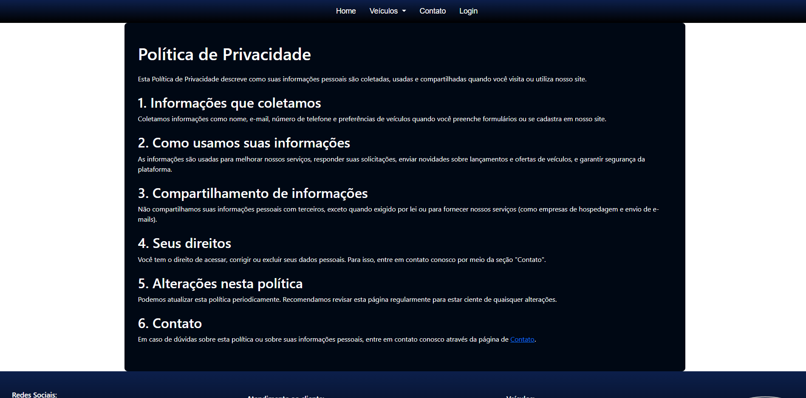
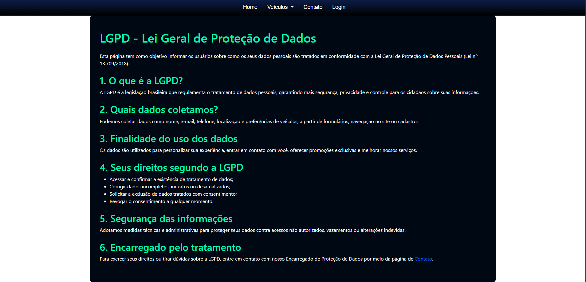
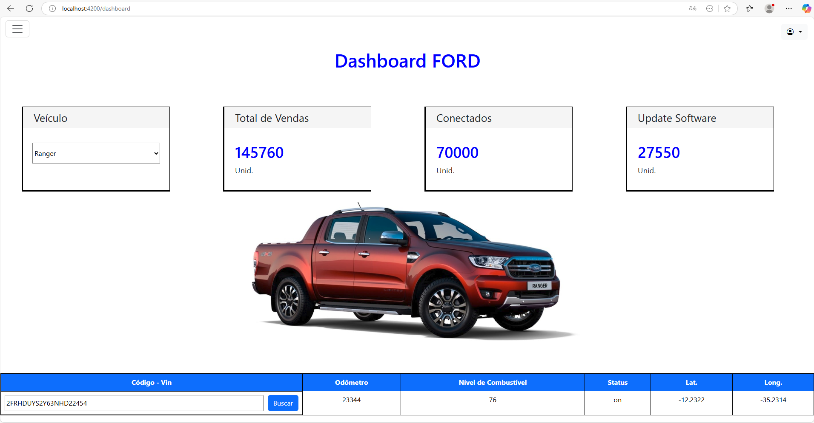

# 🚗 Dashboard FORD

Um sistema web construído com Angular e Bootstrap para visualização dinâmica de dados de veículos da marca FORD. O projeto inclui autenticação de login, cards informativos, busca por VIN, e interface responsiva com menu lateral e tabela técnica.

---

## 📸 Capturas de Tela




   


---

## 🚀 Funcionalidades

- 🔐 **Login com validação**
  - Campo de usuário e senha
- 🏚️ **Home**
  - Carrosel de veículos com informações
  - veículos com seus preços iniciais
- 🚗 **Veículos**
  - pagina para cada um dos veículos que estão na pagina inicial
  - carrosel com foto do exterior e interior do veículo
  - tabela com as principais informações do veículo
- 📒 **Contato**
  - Formulario para contato com a ford
  - coleta e salva as informações digitadas
- 📒 **Lgpd**
  - Todas informações sobre a proteção de dados
- 📒 **Politica-de-privacidade**
  - texto sobre a politica de privacidade da empresa
- 📊 **Dashboard dinâmico**
  - Seleção de veículos com `select`
  - Cards com total de vendas, conectados e atualizações
  - Imagem correspondente ao veículo selecionado
- 🔍 **Busca por VIN**
  - Input para digitar o código VIN
  - Tabela com odômetro, combustível, status, localização
- 🎨 **Interface responsiva**
  - Menu lateral (offcanvas)
  - Botão de logout
  - Layout adaptável para desktops e tablets

---

## 🛠️ Tecnologias Utilizadas

- **Angular 19.20.0** (Standalone Components)
- **Bootstrap 5.3.6**
- **TypeScript**
- **HTML5/CSS**
- **API Node.js (Express e Cors)**

---

## 🧪 Como Executar

### 🔧 Backend

1. Vá até a pasta `backend/api`
2. Instale as dependências:
   ```bash
   npm install Express
   npm install Cors
   ```
3. Inicie o servidor:
   ```bash
   node index.js
   ```
4. A API estará em: `http://localhost:3001`

### 🖥️ Frontend

1. Vá até a pasta do Angular:
   ```bash
   cd ford
   ```
2. Instale as dependências:
   ```bash
   npm install angular/cli@19.20
   npm install bootstrap
   npm install bootstrap-icons
   ```
3. Inicie o servidor:
   ```bash
   ng serve
   ```
4. Acesse: `http://localhost:4200`

---

## 🧠 Requisitos de Login

- **Usuário:** admin  
- **Senha:** 123456

---

## 📁 Estrutura de Pastas

```
📦 DESAFIOANGULARDEFINITIVO
├── src
│   ├── backend
│   │    ├── api
|   |        └── index.js
|   | app
|   ├── 📁 cabecalho
|   ├── 📁 carrossel
|   ├── 📁 contato
|   ├── 📁 dashboard
|   ├── 📁 home
|   ├── 📁 lgpd
|   ├── 📁 login
|   ├── 📁 logout
|   ├── 📁 menu
|   ├── 📁 navbar
|   ├── 📁 politica-de-privacidade
|   ├── 📁 rodape
|   ├── 📁 veiculos  
```

---

## 🏁 Melhorias Futuras

### 🔒 Segurança
- [ ] Criptografia de sessão/localStorage

### 🚗 Funcionalidades
- [ ] Adicionar todos os veículos e suas especificações
- [ ] Funcionalidade de comparação entre veículos
- [ ] Aprofundamento maior sobre cada veículo

### 📝 Cadastro
- [ ] Sistema de cadastramento de veículos


---

## 👨‍💻 Desenvolvido por

**Guilherme Costa Sousa Vilã Santos**  
• Estudante de Ciência da computação (Unijorge)  
[GitHub](https://github.com/guilhermevl71)
